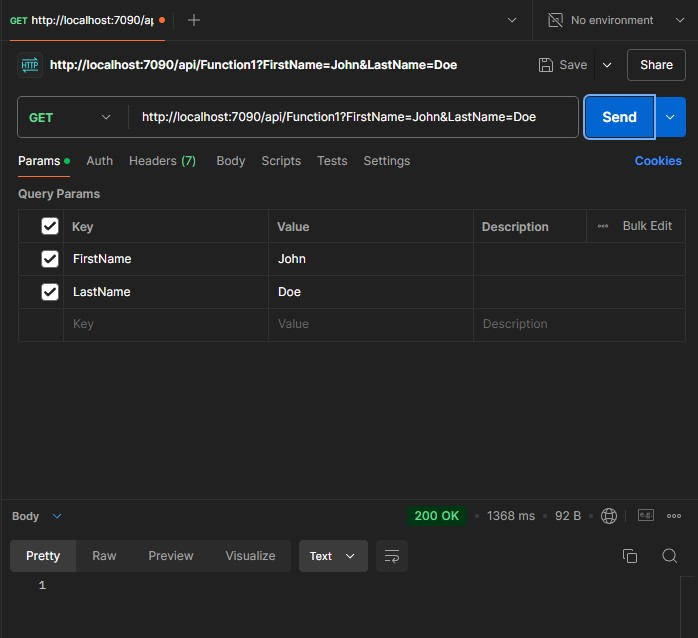
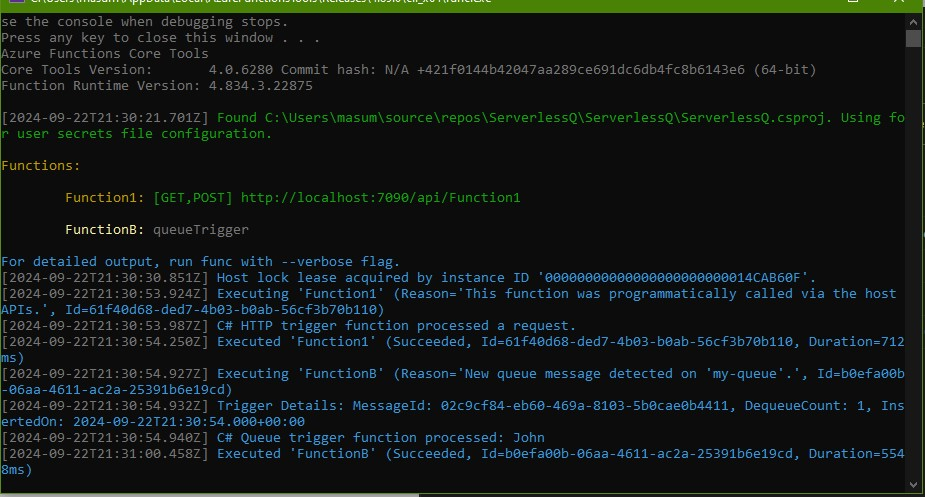
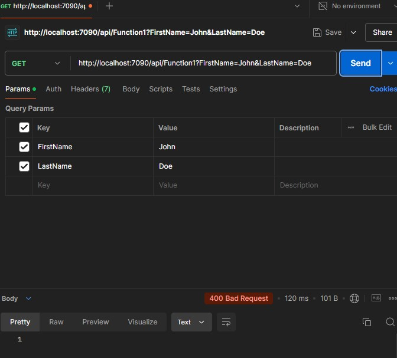
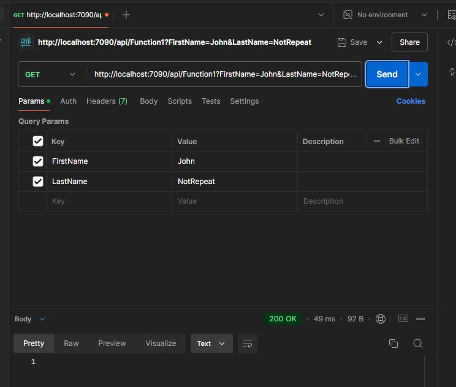

# Azure Functions Queue Communication Solution

## Summary
This project is a C# Azure Functions-based solution demonstrating communication between two Azure Functions using Azure Storage Queues. The solution includes HTTP-triggered and Queue-triggered functions that interact with an in-memory SQLite database and a REST API to process data. The solution is designed to run locally using the Azurite emulator.

## Task Details
1. **Function A**:
   - Triggered by an HTTP request containing a JSON payload with `FirstName` and `LastName`.
   - Saves the provided data to an in-memory SQLite database.
   - Publishes a message to an Azure Storage Queue with the same data.
   - Returns a `200 OK` response if the operation is successful.

2. **Function B**:
   - Triggered by messages on the Azure Storage Queue.
   - Makes an HTTP call to a REST API (`https://tagdiscovery.com/api/get-initials?name=<FULL NAME>`) passing the concatenated `FirstName` and `LastName` as `<FULL NAME>`.
   - Saves the SVG response returned by the API to the SQLite database, associated with the respective `FirstName` and `LastName`.

## Setup Instructions
1. **Prerequisites**:
   - Visual Studio 2019 or later.
   - .NET Core SDK (3.1 or later).
   - Azure Functions Tools.
   - Azurite emulator for local Azure Storage emulation.

2. **Clone the Repository**:
   ```bash
   git clone <repository-url>
   cd <repository-directory>
   ```
3. Install Dependencies:

	- Open the solution in Visual Studio.
	- Restore NuGet packages for all projects.

4. Make sure the Azurite is installed. 
5. Configure Local Settings:
	- Update local.settings.json in the Functions project to configure Azure Storage and SQLite connection strings.
	```json
	{
		"IsEncrypted": false,
		"Values": {
			"AzureWebJobsStorage": "UseDevelopmentStorage=true",
			"FUNCTIONS_WORKER_RUNTIME": "dotnet"
		}
	}	
	```
6. Build and Run the Solution:
	- Build the solution in Visual Studio.
	- Run the solution locally to ensure Azurite and the Functions are correctly configured.

## How to Run

### Start Functions Locally

1. Press F5 in Visual Studio to start the Functions project.
2. Ensure Azurite is running in the background.

### Trigger Function A

Use a tool like Postman or CURL to send an HTTP POST request to Function A:

```cURL
curl --location 'http://localhost:7090/api/Function1?FirstName=John&LastName=Doe'
```


### Verify Results

1. Verify that a 200 OK response is returned.
2. Check that the message is published to the queue.
3. Verify Function B Execution:
   - Check the console logs to confirm that Function B has processed the queue message.
   - Verify that the SVG response was saved correctly.


## Screenshot

### 1. Successful Database Save Operation
This screenshot shows a `200 OK` response for a successful save operation.




### 2. Command Line Output for Success
Command-line output showing successful execution of the function.



### 3. Error Response for Duplicate Names
This screenshot shows a `400` error response indicating a duplicate `FirstName` and `LastName` pair.



### 4. Success Response for Unique Name Pair
This screenshot shows a successful response when a unique `FirstName` and `LastName` pair is provided. Even though the `FirstName` is common.




